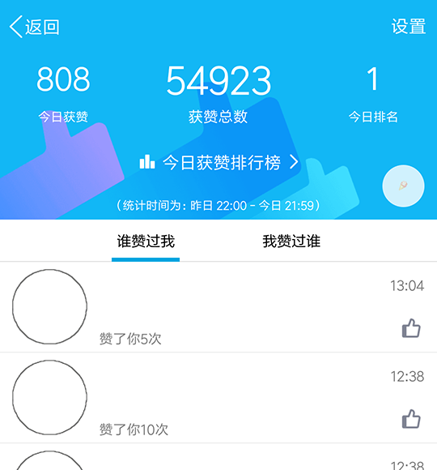

# AutoZan
An app designed to make thumbs-up to others automatically in QQ  
Using Android Accessibility Service to perform click event  
[中文](README/README.zh_CN.md)  
  

## About the first virsion  
I wrote this app in Aug. 2017. I knew almost nothing about Java and Android at that time, so the first version might seems horrible.  
It took me a few days to migrate this project to Android Studio 3.6.1 since I need to remove some sensitive data for turning it into a open-source project(the original one has ads and sponsor links).  